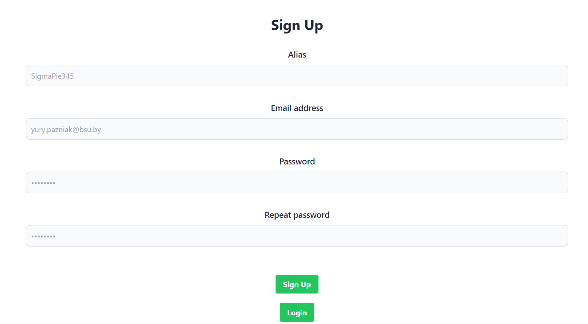
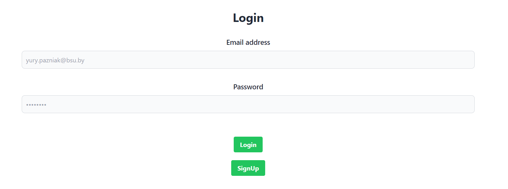
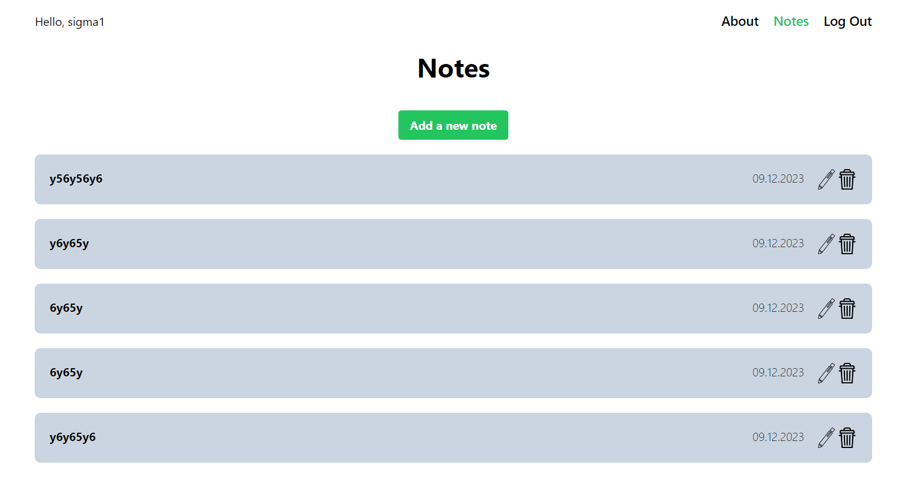
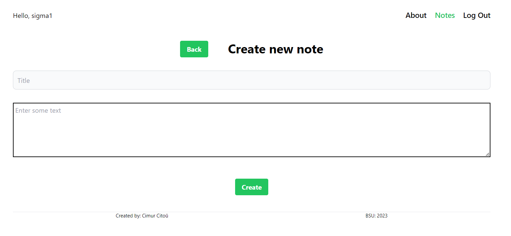
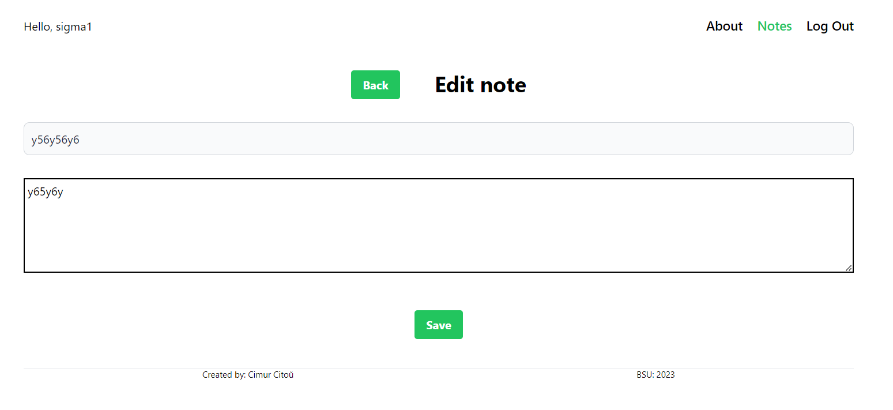
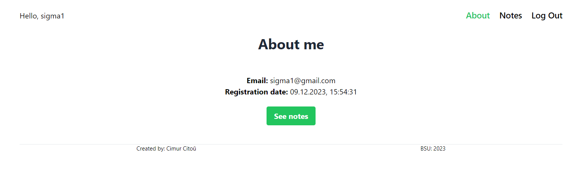

# Notion

## Introduction
Using the React framework in combination with Redux for state management, this project allows users to sign up with their credentials and securely create, edit, and delete notes. The application provides a user-friendly interface where users can easily organize their thoughts and ideas by creating personalized notes.

### Technologies
- ReactJS
- Redux
- Tailwind

### There are some screenshots








### Copy application
````commandline
   git clone https://github.com/mrDinosaur410/Notion-redux.git 
````

### Run application
````commandline
   npm install
   npm run start
````
